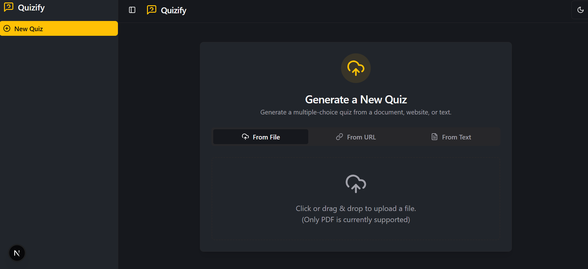

# Quizify

Quizify is an intelligent quiz generation application that transforms your documents, videos, and text into interactive multiple-choice quizzes. Powered by generative AI, Quizify makes learning and assessment more engaging and efficient.




## ✨ Features

- **Generate Quizzes from Multiple Sources**: Create quizzes from PDFs, YouTube videos, website URLs, or by simply pasting in text.
- **Interactive Quiz Experience**: Take quizzes with a clean, modern, and user-friendly interface.
- **AI-Powered Refinement**: Use the integrated chat to conversationally refine and edit your quiz questions and answers.
- **Session History**: Your past quiz sessions are saved, so you can revisit them at any time.
- **Responsive Design**: Enjoy a seamless experience on both desktop and mobile devices.
- **Light & Dark Mode**: Switch between light and dark themes to suit your preference.

## 🚀 Getting Started

To get a local copy up and running, follow these simple steps.

### Prerequisites

- Node.js (v18 or higher)
- npm

### Installation

1. Clone the repository:
   ```sh
   git clone https://github.com/Vaishnavi-A-Patil/Quizify.git
   ```
2. Navigate to the project directory:
   ```sh
   cd quizify
   ```
3. Install NPM packages:
   ```sh
   npm install
   ```
4. Run the development server:
   ```sh
   npm run dev
   ```
5. Open [http://localhost:9002](http://localhost:9002) with your browser to see the result.

## 🛠️ Tech Stack

Quizify is built with a modern, robust, and scalable tech stack:

- **[Next.js](https://nextjs.org/)**: A React framework for building server-rendered and static web applications.
- **[React](https://reactjs.org/)**: A JavaScript library for building user interfaces.
- **[Tailwind CSS](https://tailwindcss.com/)**: A utility-first CSS framework for rapid UI development.
- **[ShadCN/UI](https://ui.shadcn.com/)**: A collection of beautifully designed, reusable components.
- **[Genkit](https://firebase.google.com/docs/genkit)**: An open-source framework from Firebase to help build, deploy, and monitor AI-powered features.
- **[TypeScript](https://www.typescriptlang.org/)**: A typed superset of JavaScript that compiles to plain JavaScript.

## 📄 License

This project is licensed under the MIT License - see the `LICENSE` file for details.
